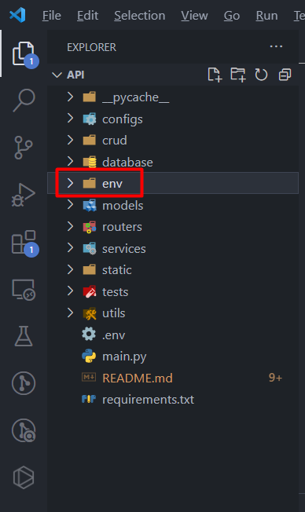
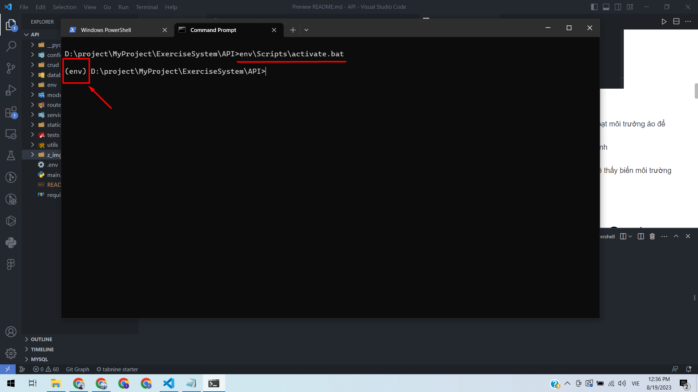
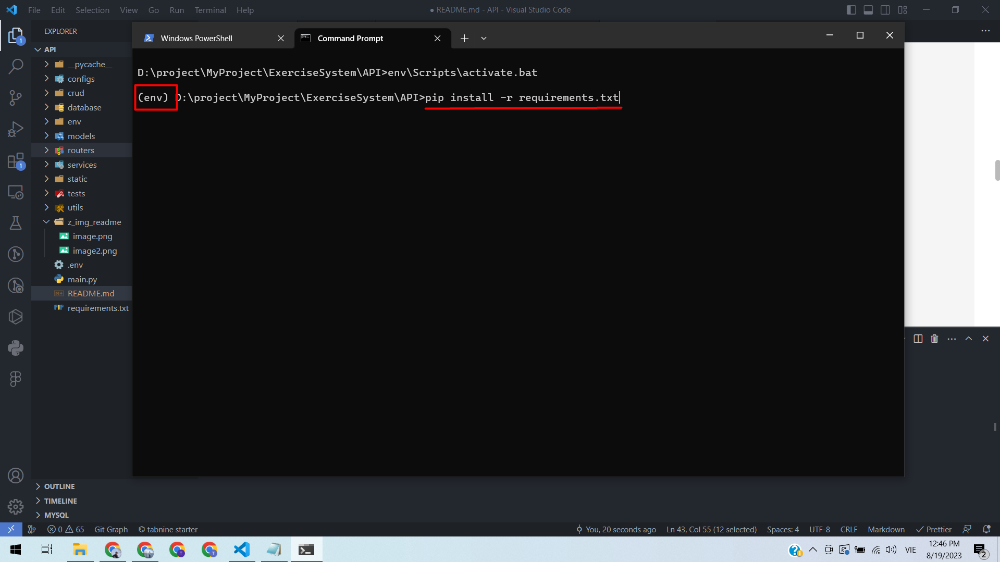
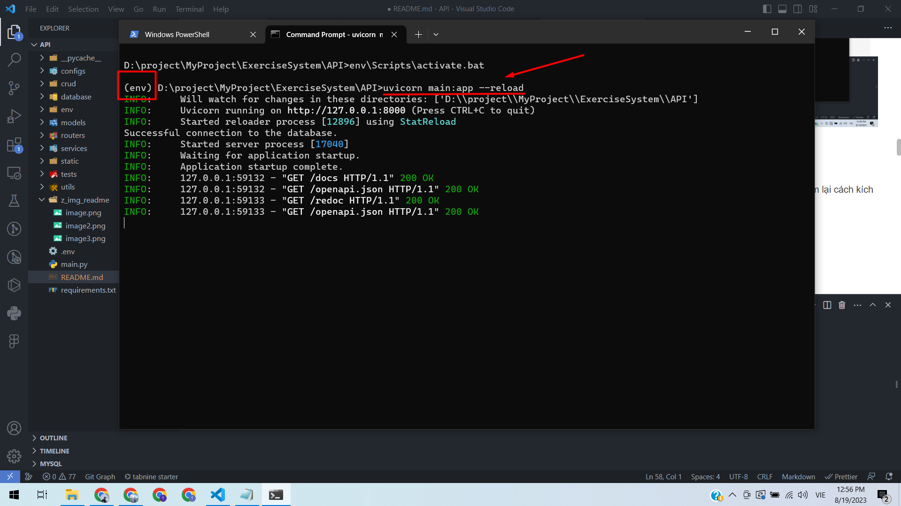
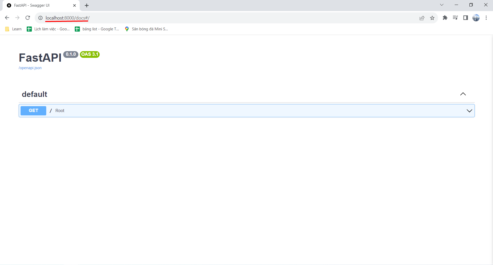
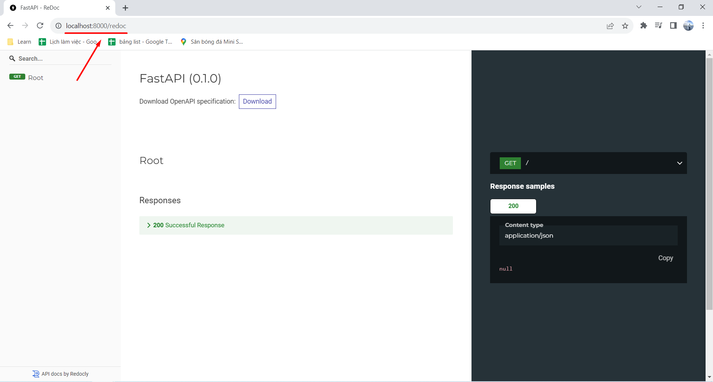

<h1 align="center">Exercise System</h1>

<br>

-   [Hướng dẫn cài đặt và chạy dự án](#hướng-dẫn-cài-đặt-và-chạy-dự-án)
    -   [Tạo môi trường ảo](#tạo-môi-trường-ảo)
    -   [Kích hoạt môi trưởng ảo](#kích-hoạt-môi-trưởng-ảo)
    -   [Cài đặt các dependencies](#cài-đặt-các-dependencies)
    -   [Chạy dự án](#chạy-dự-án)
-   [Structure API ExerciseSystem](#structure-api-exercisesystem)
    -   [env](#env)
    -   [configs](#configs)
        -   [app_config](#app_config)
        -   [config](#config)
        -   [constants](#constants)
    -   [crud](#crud)
    -   [database](#database)
        -   [databaseFile](#databasefile)
    -   [models](#models)
        -   [base](#base)
    -   [routers](#routers)
    -   [services](#services)
    -   [static](#static)
    -   [test](#test)
    -   [utils](#utils)
    -   [migrations](#migrations)

<br>

<a id="Install"></a>

# Hướng dẫn cài đặt và chạy dự án

## Tạo môi trường ảo

-   Sau khi clone dự án về. Tại thư mục gốc mở folder API sau đó tại thư mục API lên mở cửa sổ terminal lên
-   Chạy lệnh `python -m venv env`. Sau khi chạy xong trên thưc mục sẽ hiện thêm file env đây là file môt trường ảo chứa các thư viện của python
    

## Kích hoạt môi trưởng ảo

-   Sau khi tạo môi trưởng ảo chúng ta cần kích hoạt môi trưởng ảo để chạy dự án
-   Tại thư mục API mở cửa sổ terminal và chạy lệnh `env\Scripts\activate.bat`
-   Sau khi chạy lệnh sẽ thấy tại cửa số terminal sẽ thấy biến môi trường env kích hoạt trước đoạn lệnh tiếp theo
    

## Cài đặt các dependencies

-   Sau khi kích hoạt môi trưởng ảo cần tải các dependencies từ file requirements.txt
-   Để cài đặt các dependencies ta dùng lệnh `pip install -r requirements.txt`
    

## Chạy dự án

-   Để chạy dự án đầu tiền cần kích hoạt môi trưởng ảo (xem lại cách kích hoạt môi trường ảo bên trên)
-   Để chạy dự án chạy lệnh `uvicorn main:app --reload`
    
-   Khi này bạn có thể vào localhost:8000/docs hoặc http://localhost:8000/redoc để xem các api




<br>

<a id="Structure"></a>

# Structure API ExerciseSystem

```
project_root/
├──    api/
│    │
│    ├── env/
│    │
│    ├── configs/
│    │   │
│    │   ├── envs/
│    │   │   │
│    │   │   ├── development.py
│    │   │   ├── production.py
│    │   │   ├── testing.py
│    │   │   ├── ...
│    │   │
│    │   ├── app_config.py
│    │   ├── config.py
│    │   ├── constants.py
│    │   ├── ...
│    │
│    ├── crud/
│    │   ├── user.py
│    │   ├── ...
│    │
│    ├── database/
│    │   ├── database.py
│    │   ├── ...
│    │
│    ├── models/
│    │   ├── base.py
│    │   ├── schemas.py
│    │   ├── user_model.py
│    │   ├── class_model.py
│    │   ├── ...
│    │
│    ├── routers/
│    │   ├── auth.py
│    │   ├── user.py
│    │   ├── ...
│    │
│    ├── services/
│    │   ├── auth_service.py
│    │   ├── user_service.py
│    │   ├── ...
│    │
│    ├── static/
│    │   ├── example.py
│    │   ├── example.py
│    │   ├── ...
│    │
│    ├── test/
│    │   ├── test_connect_db.py
│    │   ├── test_user_admin.py
│    │   ├── ...
│    │
│    ├── utils/
│    │   ├── email.py
│    │   ├── hash.py
│    │   ├── helpers.py
│    │   ├── validators.py
│    │   ├── ...
│    │
│    ├── migrations/
│    │   ├── ...
│    │
│    ├── .env
│    ├── main.py
│    ├── README.md
│    └── requirements.txt
│    └── ...
│
```

<a id="env"></a>

## env

Folder env là thư viện của môi trường khi chúng ta chạy lệnh <python -m venv env>. Tại thư mục này các thư viện được liệt kê ở file requirement sẽ được lưu vào folder này

<a id="configs"></a>

## configs

Folder configs dùng để chứa các tệp cấu hình liên quan đến ứng dụng

<a id="app_config"></a>

### app_config

File app_config chứa các cấu hình toàn cục cho ứng dụng như cấu hình gửi email, cấu hình bảo mật, cấu hình CORS, cấu hình lưu trữ, v.v.

<a id="config"></a>

### config

File config chứa các giá trị của biến môi trường

<a id="constants"></a>

### constants

File constants chứa các hằng số có thể được sử dụng trong toàn bộ ứng dụng. Điều này giúp tách biệt các giá trị cố định ra khỏi mã nguồn chính

<a id="crud"></a>

## crud

Folder crud chứa các module hoặc package liên quan đến lớp CRUD (Create, Read, Update, Delete) của ứng dụng. Lớp CRUD chịu trách nhiệm về việc tương tác với cơ sở dữ liệu, thực hiện các thao tác thêm, sửa, xóa và truy vấn dữ liệu. Trong thư mục này, bạn thường tạo các hàm để thực hiện các thao tác cơ bản với dữ liệu cơ sở dữ liệu, như thêm mới, cập nhật, xóa, lấy dữ liệu, v.v.

<a id="database"></a>

## database

Folder database

<a id="databaseFile"></a>

### databaseFile

File database để kết nối đến cơ sử dữ liệu

<a id="models"></a>

## models

Folder models để chứa các định nghĩa mô hình dữ liệu (data models) của ứng dụng của bạn

<a id="base"></a>

### base

File base chứa cấu hình chính của models

<a id="routers"></a>

## routers

Folder routers để chứa các tệp và module liên quan đến việc định nghĩa các endpoint (đường dẫn) và các xử lý liên quan đến việc xử lý các yêu cầu HTTP từ phía người dùng

<a id="services"></a>

## services

Folder services chứa các module và tệp liên quan đến xử lý logic kinh doanh và các chức năng chính của ứng dụng

<a id="static"></a>

## static

Folder static

<a id="test"></a>

## test

Folder test chứa các tệp và thư mục liên quan đến việc kiểm tra và thử nghiệm ứng dụng

<a id="utils"></a>

## utils

Folder utils chứa các công cụ, hàm tiện ích và các phần nhỏ khác giúp hỗ trợ việc phát triển và quản lý dự án

<a id="migrations"></a>

## migrations

Folder migrations kết nối cơ sở dữ liệu có thể cung cấp các công cụ để tạo và quản lý các phiên bản cơ sở dữ liệu (migrations) khi bạn thay đổi cấu trúc cơ sở dữ liệu.
